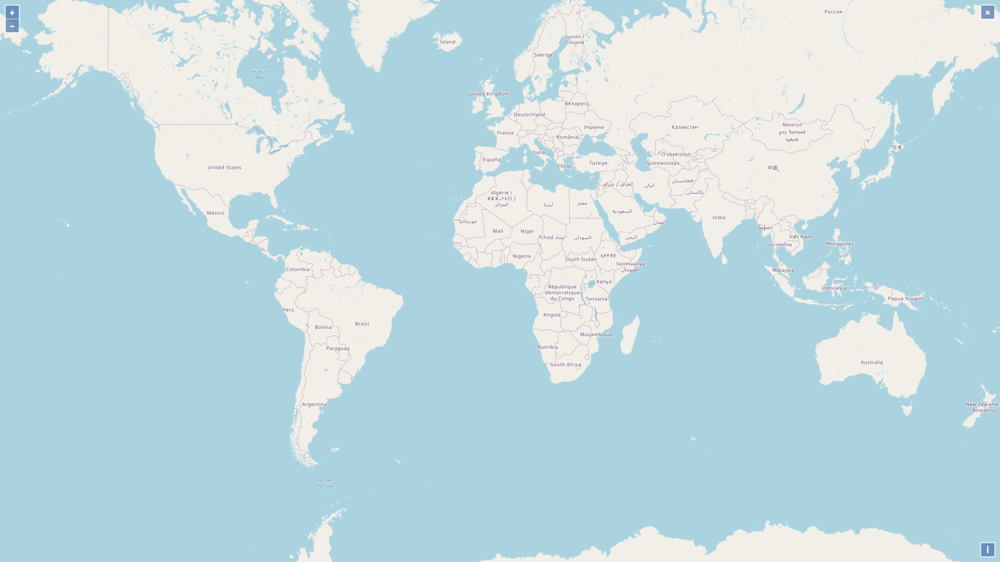

# geofluxus-map

## Map
First, create a target HTML element with a defined id to host the map like:

```<div id="map"></div>```

Then, initialize the map like so:

```const map = new GeofluxusMap({target: "map"});```

The following image should appear on your screen:



Here is an overview of all available options for a map object:

```
new GeofluxusMap({
    target: "map",
    projection: "EPSG:4326",
    base: {
        source: "osm",
        opacity: 1.0,
    },
    view: {
        zoom: 0,
        minZoom: undefined,
        maxZoom: undefined,
        center: [0, 0],
    }
    enableZoom: false,
    enableDrag: false,
    hover: {
        tooltip: {
            style: {...}
        },
        style: {
            stroke: {
                color: 'rgba(255, 0, 0, 1)',
                width: 10,
            },
            fill: {
                color: 'rbga(255, 0, 0, 1)',
            }
        }
    }
})
```

* _target (**Mandatory**)_: The id of the HTML element where the map is hosted
* _projection:_ The map projection (EPSG code) for rendering geometries. The default projection for input geometries is **EPSG:4326** (WGS84) which corresponds to longitude / latitude coordinates. All input geometries are transformed to EPSG:3857 (Web Mercator).
* _base_: The map background
    * _source_: The background provider. The default provider is OpenStreetMap (OSM). There are also other backgrounds available from CartoDB.


## Vector layers